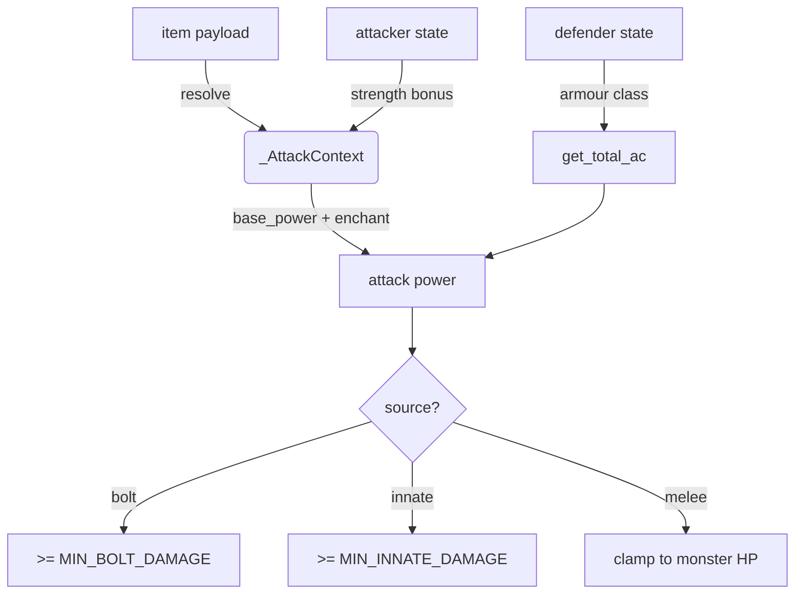

# Damage & Strike

!!! abstract "Problem"
    Combat must combine catalogue metadata, instance state, and player stats to deliver
    deterministic damage that respects enchantments, armour class, and minimum floors.

!!! info "Inputs"
    - Weapon instance or innate attack payload
    - Attacker state from `player_state`
    - Defender payload or IID

!!! success "Outputs"
    - `AttackResult` with raw damage and source (`melee`, `bolt`, `innate`)
    - Minimum damage floors and wear events applied consistently

## Attack context

`services.damage_engine` resolves everything into an `_AttackContext`:

- **Source** – Inferred from payload, template hints, or defaults to `innate` when no
  item ID is provided.
- **Base power** – Uses source-specific precedence (`base_power_bolt` for bolts,
  `base_power_melee` for melee). Falls back to template values before 0.
- **Enchant level** – Pulled from payload, instance registry (`get_enchant_level`), or 0.
- **Strength bonus** – Derived from active stats (`str_bonus` or raw strength ÷ 10).

`get_attacker_power` adds these pieces together: `base_power + 4 * enchant + strength`.

## Armour class & mitigation

`get_total_ac(defender_state)` combines `combat_calc.dex_bonus_for_active` and armour slot
bonuses. Armour data comes from the defender payload; if missing, it falls back to
registry lookups via `player_state` and `items_catalog`.

`resolve_attack` subtracts AC from the raw attack power and returns an `AttackResult`.

## Floors and clamping

- Bolt attacks enforce `MIN_BOLT_DAMAGE = 6`.
- Innate attacks enforce `MIN_INNATE_DAMAGE = 6`.
- `_clamp_melee_damage` prevents the opening swing from exceeding the monster's maximum HP
  but allows finishing blows to deal full remaining HP.

## Wear, cracks, and failure modes

- Weapon wear is computed via `items_wear.wear_from_event` and applied by
  `_apply_weapon_wear`. When registries cannot update the instance, local payloads are
  mutated and a turn log event is emitted.
- Armour wear uses `_apply_armour_wear` with similar fallbacks. Cracks replace armour with
  `broken_armour` and broadcast UI events.
- Missing instances result in warnings but do not abort the command; the validator later
  flags inconsistent state.

## Related docs

- [Runtime Flow](runtime.md)
- [Drops & Loot](drops-and-loot.md)
- [Guides → Writing Commands](../guides/writing-commands.md)
