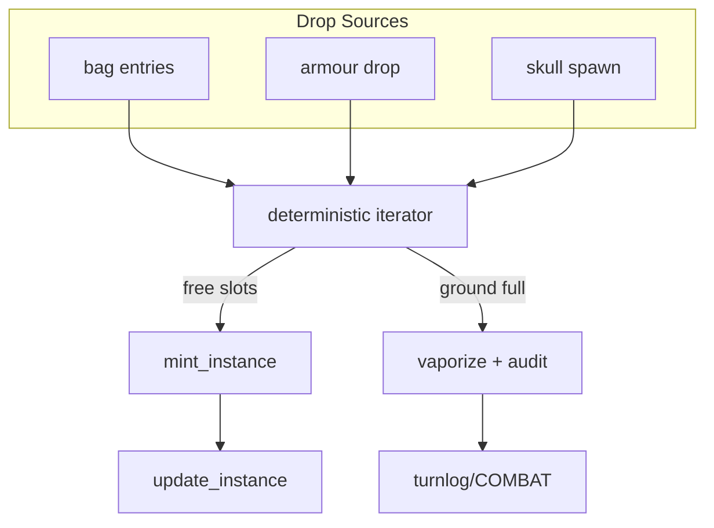

# Drops & Loot

!!! abstract "Problem"
    When a monster dies we must transform bag contents, armour payloads, and mandatory
    skulls into item instances on the ground without violating capacity constraints or
    duplicating IIDs.

!!! info "Inputs"
    - Drop summary from `monsters.kill_monster`
    - Ground capacity (`services.item_transfer.GROUND_CAP`)
    - Item catalog and instances registries

!!! success "Outputs"
    - Deterministic ordering of minted drops
    - Vaporised entries recorded when capacity is exceeded

## Deterministic partial order

`services.combat_loot.drop_monster_loot` walks sources in a fixed order:

1. Bag entries (already normalised payloads)
2. Mandatory skull (`{"item_id": "skull"}`)
3. Armour entry when provided

Within each list, entries retain their original order. Each entry is deep-copied and
annotated with `drop_source` for auditing.

## Ground capacity & vaporisation

- The ground can hold at most `GROUND_CAP` instances.
- If free slots run out, remaining entries are classified as `vaporized`; a log line is
  emitted via `LOG_DEV` and turn log events include the count.
- Vaporised payloads still record `drop_source` so tooling can replay the decision.

## IID handling

- Existing IIDs (e.g. armour already in the world) are moved via
  `items_instances.move_instance`.
- New entries call `items_instances.mint_instance`, inheriting `origin` from the drop or
  defaulting to `monster_drop`.
- Enchant level and condition defaults mirror the entry payload; missing condition is
  removed for enchanted drops to avoid conflicts with validator expectations.

## Vape rules & audit

- Armour cracks may replace the original item with `broken_armour`; the drop logic ensures
  this updated payload is minted if there is space, otherwise it vaporises with context.
- UI notifications are pushed via the combat bus, while the turn log records minted vs.
  vaporised counts for postmortem analysis.

## Related docs

- [Runtime Flow](runtime.md)
- [Registries](registries.md)
- [Guides → Extending Items](../guides/extending-items.md)
