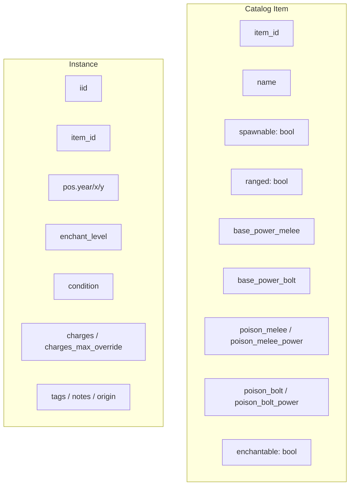

# Items Schema

!!! abstract "Problem"
    Catalogue and instance data originate from JSON files maintained over time. The
    runtime expects explicit fields and applies strict validation to avoid ambiguity in
    combat calculations and loot drops.

!!! info "Inputs"
    - `state/items/catalog.json`
    - `state/items/instances.json`

!!! success "Outputs"
    - Explicit, normalised records with deterministic base power, poison, and spawn flags
    - Backwards-compatible migration path for legacy payloads

## Catalog fields

- `item_id` (required): Unique identifier. Collision causes validator failure.
- `name` / `display_name` (required): UI label; falls back to the `item_id`.
- `spawnable` (required): Explicit `true` or `false`.
- `enchantable` (required): Explicit boolean; set `false` for ranged, potion, spell, key, and skull items.
- `ranged` (required): When `true`, provide both `base_power_melee` and `base_power_bolt`.
- `base_power_melee` (melee/ranged): Non-negative integer; derived from legacy `base_power` when present.
- `base_power_bolt` (required for ranged): Non-negative integer.
- `poison_melee` / `poison_bolt` (optional): Default `false`; when enabled, power defaults to `0`.
- `uses_charges` / `charges_max` (optional): `uses_charges` inferred when `charges_max > 0`.
- `armour_class` (optional): Used by combat calculations.

### Migration rules

- Legacy `base_power` and `poisonous`/`poison_power` fields are aliased with warnings and
  scheduled to become hard errors. Use `scripts/expand_item_power_fields.py` to migrate.
- String booleans (`"yes"`, `"no"`) are coerced to `True`/`False`.
- Missing `enchantable` defaults to `false`.

## Instance fields

- `iid` / `instance_id` – Canonical identifier. Registries keep both fields in sync.
- `item_id` – Must reference an existing catalog entry.
- `pos` and legacy `year`/`x`/`y` – Location triple. Commands call
  `items_instances.move_instance` to manage it.
- `enchant_level` – Integer clamped to 0–100.
- `condition` – Clamped to 1–100 for non-broken items; removed for `broken_*` placeholders.
- `charges` and `charges_max_override` – Runtime charge state; max defaults to catalog
  value when override missing.
- `tags`, `notes`, `origin` – Optional metadata preserved through updates.

### Damage floors & ranged split

- Bolt attacks reference `base_power_bolt`; innate attacks force a minimum damage of 6 via
  `commands.strike.MIN_BOLT_DAMAGE`.
- Melee damage uses `base_power_melee` and is clamped to avoid exceeding the monster's
  maximum HP on the opening blow.

## Validation & tooling

- `python -m mutants.bootstrap.validate` runs catalog + instance validation, failing fast
  on missing flags or invalid ranges.
- `tools/fix_iids.py` repairs duplicate instance IDs in-place, maintaining references.
- CI enforces these invariants via [`docs.yml`](../reference/adr-index.md).

## Related docs

- [Registries](registries.md)
- [Damage & Strike](damage-and-strike.md)
- [Migrations](migrations.md)
