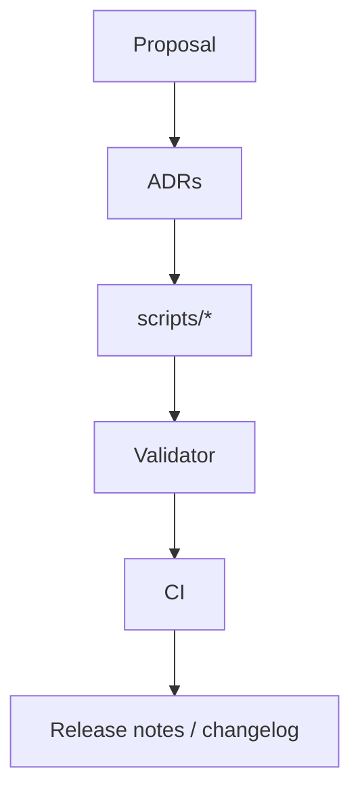

# Migrations & Deprecations

!!! abstract "Problem"
    Data schemas evolve. We need a predictable policy for introducing breaking changes,
    migrating legacy fields, and communicating deadlines.

!!! info "Inputs"
    - Catalog schema changes (e.g. ranged power split)
    - Instance invariants (IID strictness, enchant policy)
    - Tooling such as `scripts/expand_item_power_fields.py`

!!! success "Outputs"
    - Documented deprecation windows
    - Scripts that rewrite state safely
    - Validator coverage preventing regressions

## Policy

1. **Document** the change via an ADR (see [Reference → ADR Index](../reference/adr-index.md)).
2. **Provide automation** – supply a script under `scripts/` or `tools/` to rewrite state.
3. **Grace period** – validator logs warnings while both schemas are accepted. Target 30
   days before flipping to hard errors.
4. **Enforce** – after the grace period, validator raises `ValueError` and CI blocks merges.

## Current migrations

- Split `base_power` into melee/bolt — warns while the legacy field exists.
  Run `scripts/expand_item_power_fields.py`; hard error after 2024-09-01.
- Replace `poisonous` / `poison_power` — warns until the script runs.
  Use `scripts/expand_item_power_fields.py`; hard error after 2024-09-01.
- Enchantable flag mandatory — enforced immediately; no script required.
- Duplicate IID strict mode — enforced when `MUTANTS_STRICT_IIDS` or tests run.
  Repair with `tools/fix_iids.py`.

## Backwards compatibility

- Runtime helpers coerce string booleans and missing enchant flags to maintain compatibility
  with older data until the deadline.
- Commands rely on registries; bypassing them risks missing migrations and is prohibited.
- CLI tools advertise migration status in their output. Always re-run validators after a
  migration script.

## Communicating changes

- Update `docs/changelog.md` with high-level notes and link the ADR.
- Raise `MUTANTS_VALIDATE_CONTENT=1` in CI for branches that touch schema-critical code to
  surface warnings early.

## Related docs

- [Items Schema](items-schema.md)
- [Validation](validation.md)
- [Reference → ADR Index](../reference/adr-index.md)
