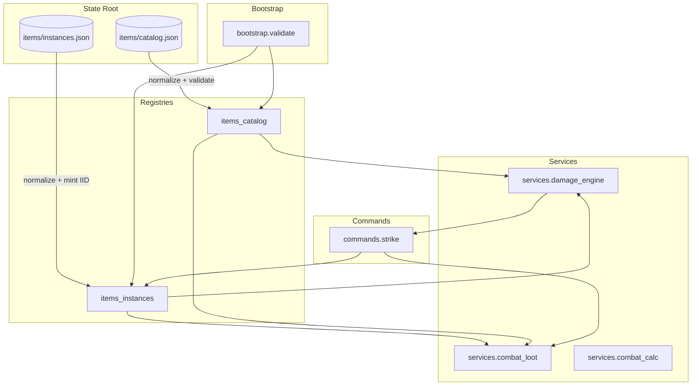

# Architecture Overview

!!! abstract "Problem"
    Persisted catalog data and live item instances must be transformed into a coherent
    runtime model that powers deterministic combat, loot, and player actions.

!!! info "Inputs"
    - Static data: `state/items/catalog.json`
    - Dynamic data: `state/items/instances.json`
    - Commands issued by the player or automation (e.g. `strike`)

!!! success "Outputs"
    - Validated registries exposed via pure services
    - Deterministic command handlers that mutate instances through the registries
    - Logs and events for UI surfaces

## Layers

- **Registries** (``mutants.registries``) provide the authoritative API for reading and
  mutating state on disk. They encapsulate validation, normalisation, and invariant
  enforcement. Registries are the only layer that writes to the unified state root.
- **Services** (``mutants.services``) encapsulate pure domain logic for combat damage,
  loot distribution, and player state derivation. Services only depend on registries and
  stateless helpers.
- **Commands** (``mutants.commands``) orchestrate services in response to player inputs.
  They may broadcast UI events through the bus but always delegate persistence to
  registries.
- **Bootstrap** (``mutants.bootstrap``) validates catalogs and instances before runtime to
  guarantee invariants and halt on corruption.

## Invariants

- Catalog entries must declare explicit boolean flags (`enchantable`, `spawnable`), split
  base powers for ranged items, and non-negative numeric values.
- Instance records must resolve to canonical IIDs, enforce enchantment bounds, and omit
  condition data for broken placeholders.
- Registries perform mint/move/update operations atomically and raise on invariant
  breaches. The `tools/fix_iids.py` utility repairs collisions without bypassing the API.

## Failure modes

- **Catalog schema drift** → `items_catalog.load_catalog` raises `ValueError` with the
  offending item ID.
- **Duplicate IIDs** → `items_instances.load_instances(strict=True)` raises `ValueError`
  and CI fails until `tools/fix_iids.py` is executed.
- **Command misuse** → commands that mutate instances without registries risk bypassing
  normalisation; our contributing guide forbids this pattern.

## Next

- [Runtime](runtime.md) dives into the request flow for a `strike` command.
- [Registries](registries.md) documents the authoritative APIs and invariants.
