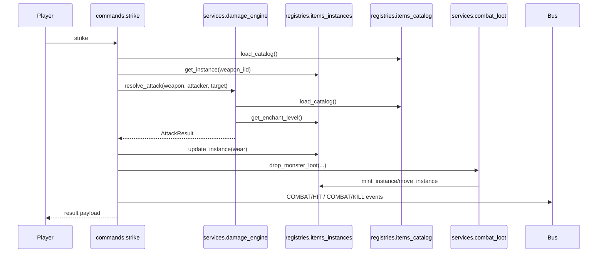

# Runtime Flow

!!! abstract "Problem"
    Players issue commands such as `strike` that must coordinate registries, combat
    services, and loot drop rules while maintaining deterministic state updates.

!!! info "Inputs"
    - Player state from `mutants.services.player_state`
    - Monster registry loaded via `mutants.registries.monsters_instances`
    - Item catalog + instances registries

!!! success "Outputs"
    - Armour class and damage calculations consistent with catalog data
    - Item wear, loot drops, and progress rewards recorded through registries
    - Turn log events and bus notifications for the UI

## Strike execution

1. **Target resolution** – `commands.strike` resolves the active player, target monster,
   and wielded weapon. Missing targets short-circuit with warnings on the feedback bus.
2. **Attack math** – `services.damage_engine.resolve_attack` combines base power (split
   melee/bolt), enchant bonuses, and attacker strength before subtracting defender armour
   class (dex bonus + armour slot).
3. **Damage floors** – Bolt attacks use `MIN_BOLT_DAMAGE` (6). Innate attacks use
   `MIN_INNATE_DAMAGE`. Melee strikes clamp damage via `_clamp_melee_damage` so opening
   blows cannot exceed the monster's maximum HP.
4. **Wear application** – Weapon wear is calculated via `items_wear.wear_from_event` and
   applied either through the registry (`items_wear.apply_wear`) or local fallback that
   updates monster armour payloads when registries lack detail.
5. **Hit resolution** – HP is decremented in-place on the monster payload. Events are
   pushed to the combat bus and turn log.
6. **Kill branch** – When HP drops to zero, the monster registry's `kill_monster` hook
   returns summary metadata used to award experience, ions, riblets, and to spawn loot.
7. **Loot drops** – `services.combat_loot.drop_monster_loot` deterministically iterates
   through bag entries, armour, and the mandatory skull spawn. It respects ground
   capacity, minting new instances or vaporising overflow with audit events.
8. **Cleanup** – The ready target flag is cleared and the monster state marked dirty so
   subsequent persistence updates the backing store.

## Failure modes & mitigation

- **Missing catalog** – `items_catalog.load_catalog` raises `FileNotFoundError`. The
  command surfaces a system warning and aborts.
- **Duplicate IIDs** – Loot drops invoke `items_instances.mint_instance`. Collisions raise
  `ValueError` when `STRICT_DUP_IIDS` is enabled (default in tests); repair with
  `tools/fix_iids.py`.
- **Wear application failure** – If registry updates fail, the command falls back to local
  payload updates to keep on-screen state consistent. Logs still highlight the missing
  instance so the validator can flag it later.

## Related docs

- [Damage & Strike](damage-and-strike.md)
- [Drops & Loot](drops-and-loot.md)
- [Validation](validation.md)
